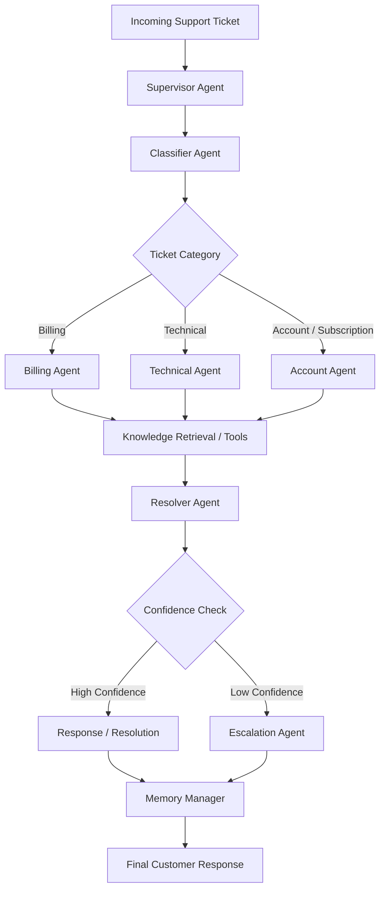

# UDA-Hub — Agentic Architecture Design

## 1. Overview

UDA-Hub is a Universal Decision Agent designed to automate customer support ticket processing.

The system receives a customer support ticket containing natural-language text and metadata. It analyzes the request, classifies it, routes it to a specialized agent, retrieves relevant knowledge or uses support tools, evaluates the resolution confidence, and either resolves the ticket or escalates it to human support.

The architecture follows a **Supervisor-based multi-agent pattern implemented using LangGraph**.

---

## 2. Architecture Pattern

UDA-Hub uses a Supervisor pattern.

The Supervisor coordinates specialized agents rather than directly solving every customer request.

Specialized agents include:

* Supervisor Agent
* Classifier Agent
* Billing Agent
* Technical Agent
* Account Agent
* Resolver Agent
* Escalation Agent
* Memory Manager

---

## 3. High-Level Architecture



---

## 4. Agent Responsibilities

### 4.1 Supervisor Agent

The Supervisor is the orchestration entry point.

Responsibilities:

* Receive the incoming ticket.
* Inspect ticket metadata.
* Initiate classification.
* Coordinate specialized agents.
* Ensure the request follows the correct workflow.
* Decide when processing should continue or terminate.

The Supervisor does not independently provide unsupported answers.

---

### 4.2 Classifier Agent

The Classifier determines the nature of the support request.

Responsibilities:

* Identify ticket category.
* Identify urgency.
* Identify priority.
* Estimate complexity.
* Produce a classification confidence score.
* Provide routing information to the Supervisor.

Example categories:

* billing
* technical
* account
* subscription
* booking
* general

---

### 4.3 Billing Agent

The Billing Agent handles financial and payment-related requests.

Examples:

* Payment failure
* Refund status
* Duplicate payment
* Billing information
* Promotional code problems

The Billing Agent can use:

* Knowledge retrieval
* Refund status tool
* Account or transaction lookup tools

---

### 4.4 Technical Agent

The Technical Agent handles application and technical problems.

Examples:

* Login problems
* Application errors
* Booking technical failures
* General application issues

The Technical Agent primarily uses the knowledge base and can escalate unresolved technical issues.

---

### 4.5 Account Agent

The Account Agent handles customer account and subscription-related requests.

Examples:

* Account creation
* Password reset
* Profile updates
* Account closure
* Subscription information
* Subscription cancellation

The Account Agent can use account and subscription tools when required.

---

### 4.6 Resolver Agent

The Resolver evaluates the information collected by the specialized agent.

Responsibilities:

* Review retrieved knowledge.
* Review tool results.
* Determine whether the issue can be resolved.
* Calculate/assign resolution confidence.
* Prepare a grounded resolution.

The Resolver must not invent information that is not supported by the knowledge base or tool results.

---

### 4.7 Escalation Agent

The Escalation Agent handles unresolved or low-confidence cases.

Escalation occurs when:

* Relevant knowledge cannot be found.
* Knowledge retrieval confidence is below the configured threshold.
* A required support operation fails.
* The request requires human intervention.
* The issue remains unresolved after the available workflow.

The agent generates an escalation summary containing:

* Customer
* Ticket
* Issue
* Relevant history
* Actions already attempted
* Reason for escalation

---

### 4.8 Memory Manager

The Memory Manager handles persistent interaction context.

Responsibilities:

* Retrieve previous customer interactions.
* Store resolved ticket information.
* Store useful customer preferences/context.
* Make historical information available to future workflows.

---

## 5. State Management

LangGraph maintains a shared state throughout the workflow.

The state contains information such as:

* Ticket information
* Customer information
* Classification
* Routing decision
* Retrieved knowledge
* Tool results
* Agent decisions
* Confidence score
* Resolution
* Escalation status
* Conversation messages
* Memory context

This allows each agent to receive the output of previous agents without relying on global variables.

---

## 6. Short-Term Memory

Short-term memory maintains context during the same conversation/session.

A `thread_id` is used to identify the conversation.

Example:

```text
thread_id = customer_001_session_01
```

Messages and intermediate workflow state can therefore remain available across multiple interactions within the same session.

---

## 7. Long-Term Memory

Long-term memory persists information across separate sessions.

UDA-Hub stores useful historical information in a persistent database.

Example:

```text
Customer:
CULT-001

Previous issue:
Payment failure

Previous resolution:
Customer was advised to retry the payment.

Current issue:
Payment failed again.
```

The workflow can retrieve the previous interaction and provide context-aware support.

---

## 8. Knowledge Retrieval

The Knowledge table contains CultPass support articles.

The RAG pipeline follows:

```text
Customer Ticket
      |
      v
Text Processing
      |
      v
Embedding Generation
      |
      v
Vector Search
      |
      v
Relevant Knowledge Articles
      |
      v
Similarity / Confidence
      |
      +------ High confidence ------> Resolver
      |
      +------ Low confidence -------> Escalation
```

All customer-facing answers must be grounded in retrieved knowledge or validated tool results.

---

## 9. Tool Integration

UDA-Hub uses database abstraction tools instead of allowing agents to directly manipulate the database.

Initial support tools include:

* Account Lookup
* Subscription Lookup
* Refund Status
* Ticket History

Each tool validates its input and returns structured results.

Agents invoke tools when the ticket requires operational information.

---

## 10. Routing Logic

Routing is based on ticket classification and metadata.

Example:

```text
Billing
   -> Billing Agent

Technical
   -> Technical Agent

Account / Subscription
   -> Account Agent

Unknown / Unsupported
   -> Escalation Agent
```

Urgency and complexity are also considered when determining whether a request should be resolved automatically or escalated.

---

## 11. Confidence and Escalation

The system uses confidence-based decision making.

Conceptually:

```text
                    Resolver
                       |
                Confidence Score
                       |
             +---------+---------+
             |                   |
          >= threshold       < threshold
             |                   |
          Resolve             Escalate
```

The threshold is configurable.

This prevents UDA-Hub from generating unsupported answers when the available knowledge is insufficient.

---

## 12. Expected Inputs

Example input:

```json
{
  "customer_id": "CULT-001",
  "channel": "chat",
  "urgency": "high",
  "subject": "Payment failed",
  "description": "My payment failed while renewing my subscription."
}
```

---

## 13. Expected Outputs

Successful resolution:

```json
{
  "status": "resolved",
  "category": "billing",
  "confidence": 0.92,
  "response": "..."
}
```

Escalation:

```json
{
  "status": "escalated",
  "category": "unknown",
  "confidence": 0.32,
  "escalation_reason": "No relevant knowledge found",
  "summary": "..."
}
```

---

## 14. Error Handling

The system should gracefully handle:

* Missing customer information
* Invalid ticket data
* Database errors
* Tool failures
* Empty knowledge results
* Low retrieval confidence
* Unsupported requests
* Agent execution errors

Errors are logged for troubleshooting and auditability.

---

## 15. Logging

Structured logs capture:

* Ticket received
* Classification result
* Routing decision
* Agent execution
* Knowledge retrieval
* Tool invocation
* Confidence score
* Resolution
* Escalation
* Errors

This provides traceability for every support decision.

---

## 16. Design Principles

UDA-Hub follows these principles:

1. **Agent specialization** — each agent has a clearly defined responsibility.
2. **Supervisor orchestration** — routing is centrally coordinated.
3. **Grounded responses** — answers are based on knowledge or validated tool results.
4. **Confidence-based automation** — uncertain cases are escalated.
5. **Database abstraction** — agents interact with support tools instead of raw database operations.
6. **Persistent memory** — previous interactions can improve future support.
7. **Observable execution** — decisions and actions are logged.
8. **Modularity** — agents, tools, RAG, state, and workflow are separated into modules.
9. **Testability** — each major component and end-to-end workflow can be tested independently.
